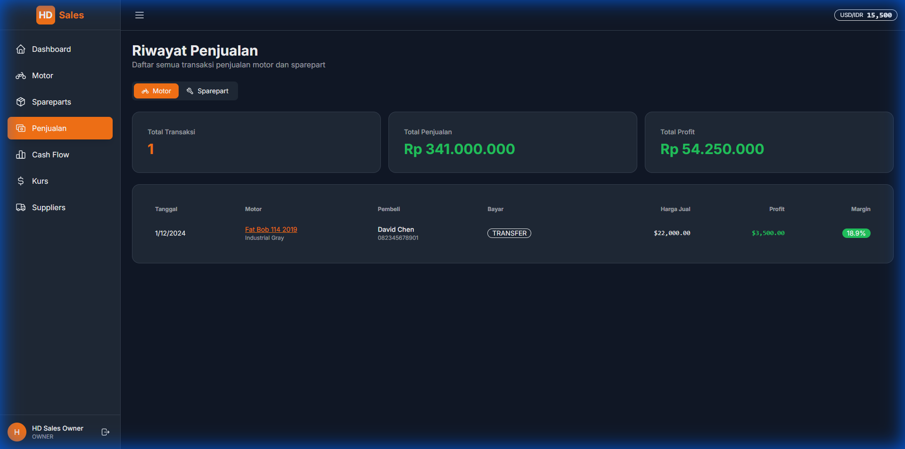
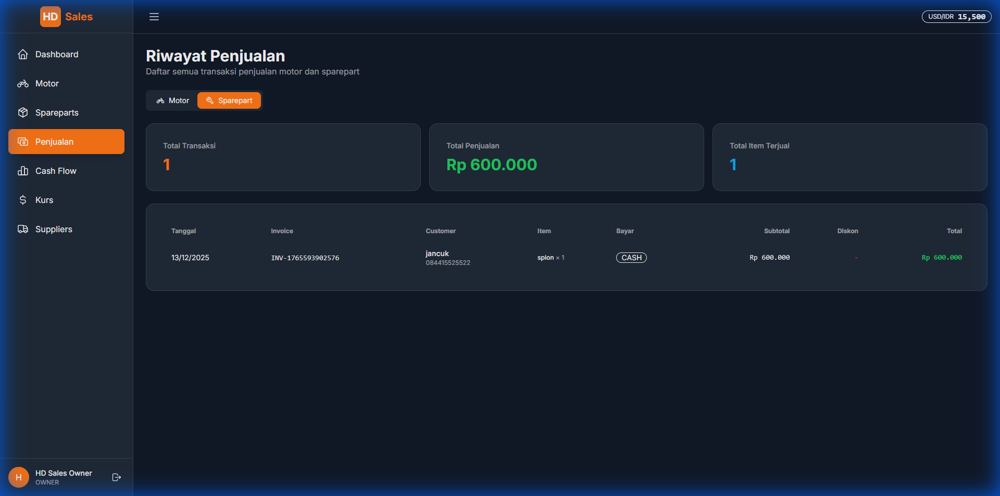
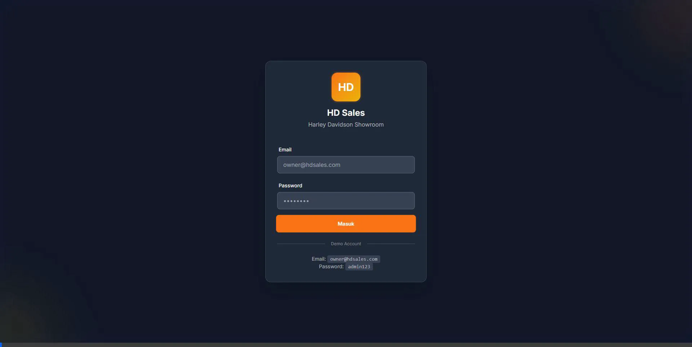

# Walkthrough: Menambahkan Penjualan Sparepart ke Halaman Sales

## Ringkasan
Berhasil menambahkan tampilan penjualan sparepart ke halaman sales yang sebelumnya hanya menampilkan penjualan motor. Implementasi menggunakan tab interface untuk memisahkan kedua jenis penjualan.

## Perubahan yang Dilakukan

### 1. API Endpoint Enhancement
**File**: [index.get.ts](file:///d:/dev/hdSales/app/server/api/sales/index.get.ts)

Menambahkan parameter `type` untuk filtering:
- `type=motorcycle` - Menampilkan penjualan motor (default)
- `type=sparepart` - Menampilkan penjualan sparepart
- `type=all` - Menggabungkan kedua jenis penjualan

API sekarang dapat query dari dua tabel berbeda (`SaleTransaction` dan `SparepartSale`) berdasarkan parameter yang diberikan.

---

### 2. Frontend UI Update
**File**: [index.vue](file:///d:/dev/hdSales/app/pages/sales/index.vue)

Perubahan utama:
- ✅ Menambahkan tab interface untuk switch antara Motor dan Sparepart
- ✅ Tabel terpisah dengan kolom yang sesuai untuk setiap jenis penjualan
- ✅ Summary cards yang dinamis berdasarkan tab aktif
- ✅ Empty state yang berbeda untuk setiap tab

**Tab Motor** menampilkan:
- Tanggal, Motor, Pembeli, Metode Bayar
- Harga Jual, Profit, Margin

**Tab Sparepart** menampilkan:
- Tanggal, Invoice, Customer, Item
- Metode Bayar, Subtotal, Diskon, Total

## Hasil Verifikasi

### Tab Motor

### Tab Sparepart

### Demo Recording

## Testing yang Dilakukan

✅ **Tab Navigation** - Berhasil switch antara tab Motor dan Sparepart  
✅ **Data Display** - Kedua jenis penjualan muncul dengan benar  
✅ **Summary Cards** - Menampilkan statistik yang sesuai per tab  
✅ **Responsive Layout** - Tabel dapat di-scroll horizontal  
✅ **Empty State** - Menampilkan pesan yang sesuai jika tidak ada data

## Kesimpulan

Halaman sales sekarang dapat menampilkan **kedua jenis penjualan** (motor dan sparepart) dengan interface yang clean dan mudah digunakan. User dapat dengan mudah beralih antara kedua tab untuk melihat data yang diinginkan.
